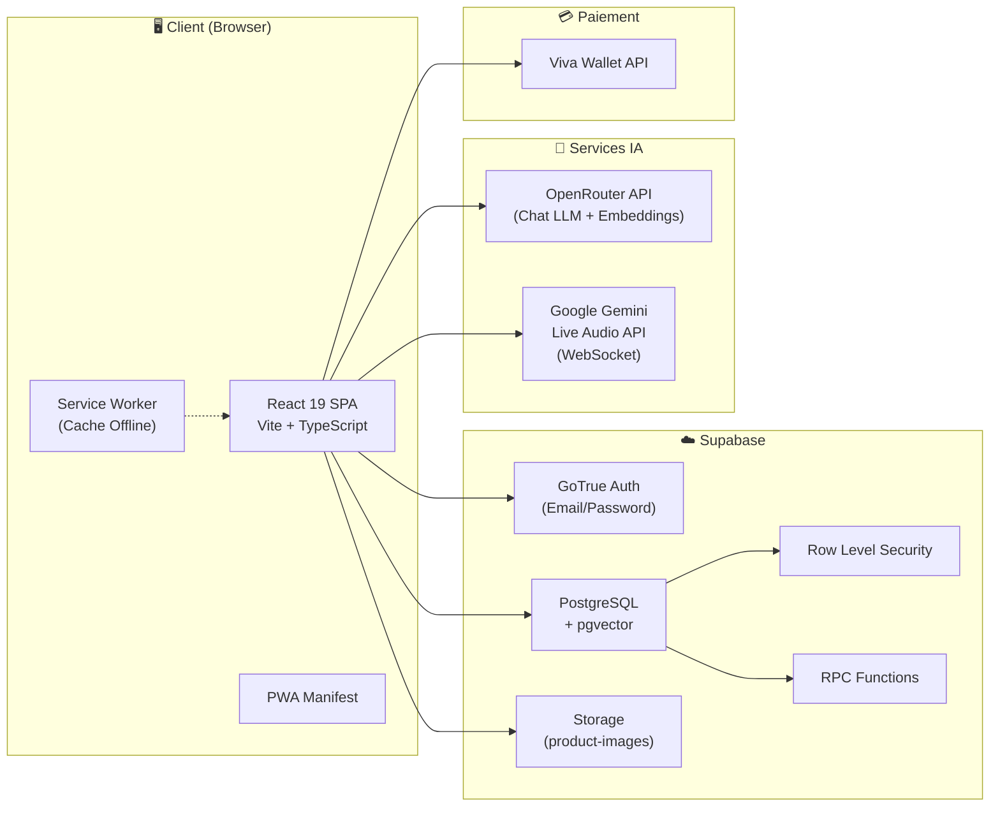
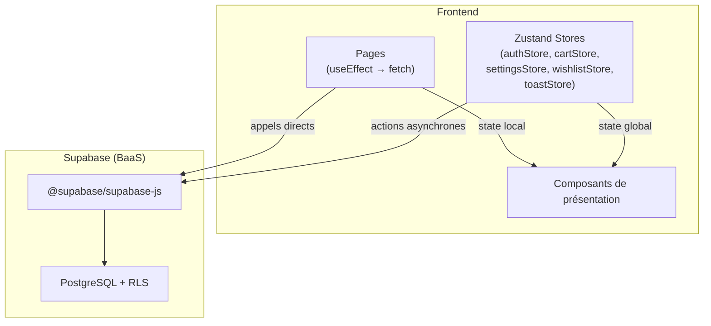
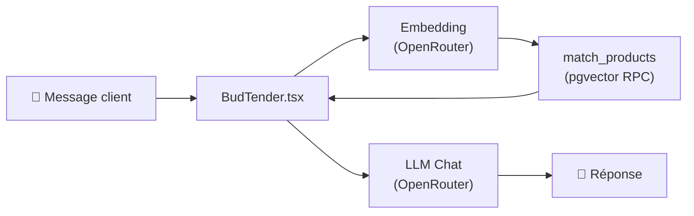
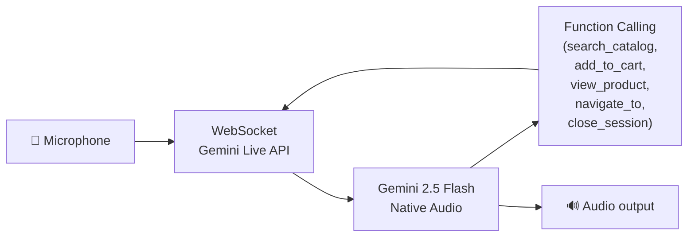

# 🏗 Architecture Technique — Green Mood CBD

## Vue d'ensemble

Green Mood est une **Single Page Application (SPA)** React avec un backend entièrement managé par **Supabase** (BaaS). Il n'y a pas de serveur Node.js/API intermédiaire : toutes les interactions avec la base de données, l'authentification et le stockage se font directement via le SDK client Supabase, protégées par **Row Level Security (RLS)**.

L'intelligence artificielle repose sur deux services externes : **OpenRouter** (chat texte et embeddings vectoriels) et **Google Gemini** (conseiller vocal temps réel via WebSocket).

---

## Diagramme Global



---

## Architecture Applicative

### Pattern : SPA avec BaaS (Backend-as-a-Service)

L'application suit un pattern **monolithique côté client** avec un BaaS :

- **Pas de backend Node.js** — Supabase sert de backend complet
- **Pas d'API intermédiaire** — Les appels DB, auth, et storage sont effectués directement depuis le client via le SDK `@supabase/supabase-js`
- **Sécurité** — Assurée intégralement par les politiques RLS de PostgreSQL
- **Calculs lourds** — Délégués à des fonctions RPC PostgreSQL (`match_products`, `sync_bundle_stock`, `get_product_recommendations`, etc.)

### Flux de données



---

## Organisation des dossiers

```
src/
├── App.tsx                    # Routeur principal (BrowserRouter + Routes)
├── main.tsx                   # Point d'entrée (StrictMode + ErrorBoundary + SEO)
├── index.css                  # Design system (theme, fonts, glow effects, glassmorphism)
│
├── components/                # Composants réutilisables
│   ├── Layout.tsx             # Shell principal (Header, Footer, Cart Sidebar, Search, BudTender)
│   ├── ProtectedRoute.tsx     # Guard route : utilisateur connecté requis
│   ├── AdminRoute.tsx         # Guard route : rôle admin requis (profil.is_admin)
│   ├── BudTender.tsx          # Composant IA principal (91KB — quiz, chat, embedding search)
│   ├── VoiceAdvisor.tsx       # Interface du conseiller vocal Gemini
│   ├── CartSidebar.tsx        # Sidebar panier glissant
│   ├── ProductCard.tsx        # Carte produit réutilisable
│   ├── SEO.tsx                # Composant Head SEO dynamique
│   ├── admin/                 # 19 onglets du back-office admin
│   │   ├── AdminDashboardTab    # KPIs temps réel
│   │   ├── AdminProductsTab     # CRUD produits + import CSV + IA description
│   │   ├── AdminCategoriesTab   # CRUD catégories
│   │   ├── AdminOrdersTab       # Gestion commandes
│   │   ├── AdminStockTab        # Mouvements de stock
│   │   ├── AdminPOSTab          # Caisse enregistreuse (132KB)
│   │   ├── AdminAnalyticsTab    # Graphiques / Charts
│   │   ├── AdminBudTenderTab    # Configuration IA
│   │   ├── AdminPromoCodesTab   # Codes promotion
│   │   ├── AdminRecommendationsTab  # Cross-selling
│   │   ├── AdminCustomersTab    # Gestion clients
│   │   ├── AdminReviewsTab      # Modération avis
│   │   ├── AdminSubscriptionsTab # Gestion abonnements
│   │   ├── AdminReferralsTab    # Programme parrainage
│   │   ├── AdminSettingsTab     # Paramètres boutique
│   │   ├── CSVImporter.tsx      # Import CSV de produits
│   │   ├── MassModifyModal.tsx  # Modification en masse
│   │   └── ProductImageUpload   # Upload image Supabase Storage
│   └── budtender-ui/          # Sous-composants UI du chat IA
│       ├── BudTenderWidget      # FAB flottant avec pulse
│       ├── BudTenderMessage     # Bulle message (Markdown)
│       ├── BudTenderTypingIndicator  # Indicateur de saisie
│       └── BudTenderFeedback    # Feedback positif/négatif
│
├── pages/                     # Vues complètes (lazy-loaded)
│   ├── Home.tsx               # Page d'accueil (hero, best-sellers, reviews, FAQ)
│   ├── Catalog.tsx            # Catalogue produits (filtres, tri, search sémantique)
│   ├── ProductDetail.tsx      # Fiche produit détaillée (46KB)
│   ├── Shop.tsx               # Page boutique physique
│   ├── Cart.tsx / Checkout.tsx  # Panier et paiement
│   ├── Login.tsx              # Connexion (email/password + inscription avec parrainage)
│   ├── Account.tsx            # Tableau de bord compte
│   ├── Profile.tsx            # Profil utilisateur (sessions actives, 2FA)
│   ├── Orders.tsx             # Historique commandes
│   ├── LoyaltyHistory.tsx     # Historique fidélité
│   ├── Referrals.tsx          # Programme parrainage
│   ├── Subscriptions.tsx      # Abonnements récurrents
│   ├── Admin.tsx              # Container du back-office admin
│   ├── POSPage.tsx            # Wrapper POS
│   └── guides/GuidePage.tsx   # Pages guides CBD (SEO)
│
├── store/                     # Stores Zustand
│   ├── authStore.ts           # Authentification, session, profil
│   ├── cartStore.ts           # Panier (persist localStorage)
│   ├── settingsStore.ts       # Configuration boutique (Supabase)
│   ├── wishlistStore.ts       # Favoris (persist localStorage)
│   └── toastStore.ts          # Notifications toast
│
├── hooks/                     # Hooks personnalisés
│   ├── useBudTenderMemory.ts  # Mémoire client IA (préférences, historique)
│   └── useGeminiLiveVoice.ts  # Session vocale WebSocket Gemini Live
│
├── lib/                       # Utilitaires et logique métier
│   ├── supabase.ts            # Client Supabase singleton
│   ├── types.ts               # Types TypeScript (Product, Order, Profile, etc.)
│   ├── constants.ts           # Slugs catégories (source unique de vérité)
│   ├── embeddings.ts          # Génération d'embeddings (OpenRouter API)
│   ├── productAI.ts           # Génération IA de descriptions produit
│   ├── budtenderPrompts.ts    # Prompts système (quiz, chat, voix)
│   ├── budtenderSettings.ts   # Configuration BudTender (quiz, modèle IA)
│   ├── budtenderCache.ts      # Cache TTL + LRU (produits, settings, embeddings)
│   ├── utils.ts               # Utilitaires (slugify, sleep, isQuotaError)
│   └── seo/                   # SEO helpers
│       ├── metaBuilder.ts     # Génération meta tags
│       ├── schemaBuilder.ts   # Génération JSON-LD (schema.org)
│       └── internalLinks.ts   # Maillage interne
│
└── seo/
    └── SEOProvider.tsx        # Provider React pour les meta globaux
```

---

## Gestion d'état

| Store | Persistance | Responsabilité |
|---|---|---|
| `authStore` | Session Supabase | User, session, profil, inscription, login/logout, reset password |
| `cartStore` | `localStorage` (`greenMood-cart`) | Articles panier, quantités, type livraison, calcul sous-total/total |
| `settingsStore` | Mémoire (fetch Supabase) | Paramètres boutique (bannière, frais, horaires, toggles fonctionnalités) |
| `wishlistStore` | `localStorage` (`greenMood-wishlist`) | IDs produits favoris |
| `toastStore` | Mémoire | File de notifications toast (success/error/info) |

---

## Sécurité

### Authentification
- **Supabase GoTrue** — Email/Password, gestion de session JWT
- **Trigger DB** — Création automatique du profil à l'inscription (`handle_new_user`)
- **Guards React** — `ProtectedRoute` (user connecté) et `AdminRoute` (is_admin = true)

### Autorisation (RLS)
Chaque table utilise des politiques Row Level Security :

| Table | Lecture | Écriture |
|---|---|---|
| `categories` | Publique | Admin uniquement |
| `products` | Publique | Admin uniquement |
| `profiles` | Owner + Admin | Owner (update) / Admin (all) |
| `addresses` | Owner | Owner |
| `orders` | Owner + Admin | Auth (insert) / Admin (update) |
| `order_items` | Owner + Admin | Auth (insert) |
| `reviews` | Publiée ou Owner ou Admin | Owner (insert/update) / Admin (all) |
| `store_settings` | Publique | Admin uniquement |
| `promo_codes` | Authentifié | Admin uniquement |
| `pos_reports` | Admin | Admin |
| `user_active_sessions` | Owner | Owner |

---

## Intelligence Artificielle

### BudTender (Chat Texte)



- **Quiz guidé** — 5 étapes (besoin, expérience, format, budget, âge)
- **Chat libre** — Conversation naturelle avec contexte catalogue
- **Recherche sémantique** — Embedding de la requête → cosine similarity via `match_products` (pgvector)
- **Mémoire** — Préférences persistées dans `user_ai_preferences` (Supabase)
- **Cache** — Embeddings LRU (50 entrées, TTL 10 min), produits TTL 5 min

### BudTender (Voix)



- **Modèle** — `gemini-2.5-flash-native-audio-preview`
- **Input** — PCM 16-bit 16kHz (AudioWorklet)
- **Output** — PCM 24kHz → WebAudio API
- **Function Calling** — `search_catalog`, `add_to_cart`, `view_product`, `navigate_to`, `close_session`

---

## Performance

### Code Splitting
Toutes les pages sont chargées en **lazy loading** via `React.lazy()` + `Suspense`.

### Caching
- **Service Worker** — Stale-While-Revalidate (exclut Supabase & OpenRouter)
- **TTL Cache** — Produits (5 min), Settings BudTender (2 min)
- **LRU Cache** — Embeddings (50 entrées, 10 min)
- **Panier & Favoris** — Persistés via Zustand `persist` middleware

### Optimisations Vite
- Déduplication React (`resolve.dedupe`)
- Pré-bundling ESM (`optimizeDeps.include`)
- HMR conditionnel (désactivé en AI Studio)

---

## SEO

| Mécanisme | Implémentation |
|---|---|
| Meta tags dynamiques | `SEO.tsx` + `metaBuilder.ts` |
| JSON-LD (schema.org) | `schemaBuilder.ts` (Product, Organization, BreadcrumbList) |
| Sitemaps | `sitemap.xml` (index) → `sitemap-pages.xml`, `sitemap-products.xml`, `sitemap-blog.xml` |
| robots.txt | AI-friendly (GPTBot, ClaudeBot, PerplexityBot autorisés) |
| llms.txt / ai.txt | Contexte pour crawlers IA |
| PWA | `manifest.webmanifest`, Service Worker, icônes |
| Maillage interne | `internalLinks.ts` |
