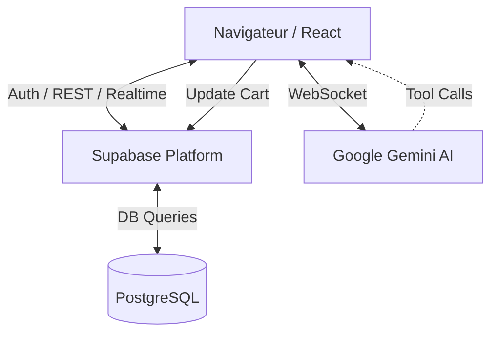

# 🏗️ Architecture du Projet

Ce document détaille l'organisation technique et les choix architecturaux de Green Mood CBD.

## 📱 Frontend

L'application est une **Single Page Application (SPA)** construite avec **React 19** et **Vite**.

### Organisation des dossiers
- `src/pages/` : Contient les composants de haut niveau représentant les routes.
- `src/components/` : Composants UI atomiques et complexes.
- `src/store/` : Gestion de l'état global via **Zustand**. Sépare les préoccupations (Auth, Cart, Settings).
- `src/hooks/` : Encapsulation de la logique réutilisable (ex: `useGeminiLiveVoice`).

### Gestion de l'état
- **AuthStore** : Gère la session utilisateur avec Supabase Auth.
- **CartStore** : Persistance locale du panier.
- **SettingsStore** : Paramètres globaux de la boutique récupérés depuis la DB.

---

## ☁️ Backend (BaaS)

Nous utilisons **Supabase** comme solution Backend-as-a-Service.

### Services utilisés
1. **PostgreSQL** : Base de données relationnelle principale.
2. **Supabase Auth** : Gestion des inscriptions, connexions et RLS (Row Level Security).
3. **Supabase Storage** : Hébergement des images produits via des buckets publics.
4. **Supabase Edge Functions** : (Optionnel) Pour les traitements lourds ou secrets (ex: intégration paiement Viva Wallet).

### Sécurité (RLS)
Chaque table est protégée par des politiques de **Row Level Security** :
- Lecture publique pour les produits et catégories.
- Lecture/Écriture restreinte à l'utilisateur pour son profil et ses commandes.
- Accès total pour les administrateurs (`is_admin = true`).

---

## 🤖 Intelligence Artificielle

L'intégration de l'IA est le coeur de l'innovation du projet.

### Google Gemini AI
- **Modèle** : Gemini 2.0 (via Multimodal Live API).
- **Intégration** : Communication via WebSockets pour une interaction vocale à faible latence.
- **Fonctions (Tools)** : L'IA peut appeler des fonctions pour interagir avec l'application (ex: `add_to_cart`).

---

## 📡 Flux de Données

## 🔐 Authentification
Le flux d'authentification utilise les JWT fournis par Supabase. Le hook `useAuthStore` initialise la session au chargement de l'application (`App.tsx`).
