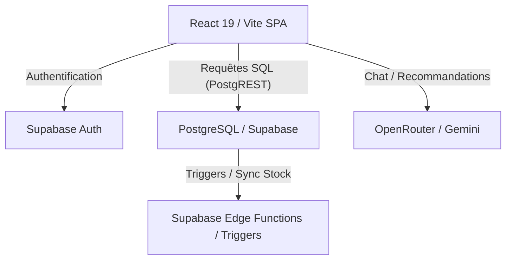

# 🏗️ Green Moon Architecture Guide

Ce guide documente l'architecture logicielle de la plateforme **Green Moon**, de l'interface utilisateur à la persistance des données.

---

## 🏛️ Vue d'Ensemble
L'application suit une architecture **Single-Page Application (SPA)** décentralisée via un Backend-as-a-Service (**BaaS**) complet.

---

## 🎨 Frontend (React 19)

### 🛤️ Routage
Le routage est géré par **React Router 7**, avec des routes publiques, protégées par `ProtectedRoute.tsx` (utilisateur connecté requis) et `AdminRoute.tsx` (profil `is_admin = true` requis).

### 💎 Design System
- **Tailwind CSS 4** : Piloté par des utility classes pour une personnalisation rapide.
- **Micro-animations** : Utilisant `motion/react` (Framer Motion) pour des transitions fluides (transitions de page, hover effects, feedbacks).
- **Glassmorphism** : Thème sombre avec des effets de transparence et de flou (backdrop-blur) pour une esthétique premium.

### 🧠 Gestion de l'État (State Management)
Plusieurs stores **Zustand** découpent la logique pour éviter les re-renders excessifs :
- `authStore` : Gère la session, l'utilisateur et le profil synchronisé.
- `cartStore` : Panier persistant avec détection Click & Collect.
- `wishlistStore` : Favoris (wishlist) synchronisés avec Supabase.
- `settingsStore` : Paramètres globaux de la boutique (bannières, horaires) modifiables par l'admin.
- `toastStore` : Système de notification global.

---

## 🛠️ Backend & Persistance (Supabase)

### 📊 Base de Données
Plutôt qu'un serveur dédié, nous utilisons directement l'intelligence de **PostgreSQL** :
- **RLS (Row Level Security)** : Chaque table a des politiques strictes pour garantir que les utilisateurs ne voient ou n'éditent que leurs propres données.
- **Triggers & Functions** : Exécution de logique métier côté serveur (synchronisation du stock des bundles, calcul de points de fidélité).

### 🤖 Intelligence Artificielle (BudTender)
L'IA est intégrée via le composant `BudTender.tsx` en utilisant l'API **OpenRouter**.
- **Mémoire Persistante** : Le hook `useBudTenderMemory` synchronise les préférences utilisateur (`user_ai_preferences`) et l'historique des conversations (`budtender_interactions`) directement dans Supabase.

---

## 📦 Services Externes
1. **Supabase Auth** : Inscription, connexion, gestion des jetons JWT.
2. **Supabase Storage** : Hébergement des images produits uploadées par l'admin.
3. **OpenRouter** : Proxy vers différents modèles de langage (LLM) comme Gemini ou Claude.
4. **Viva Wallet** : Simulation du tunnel de paiement sécurisé.

---

## 🔄 Flux de Données (Exemple : Commande)
1. L'utilisateur remplit son panier (`cartStore`).
2. Le checkout valide le code promo (`Supabase Query`).
3. L'utilisateur confirme la commande.
4. Une transaction est créée dans `orders`.
5. Un trigger SQL met à jour le stock dans `products` et génère les points de fidélité dans `profiles`.
6. L'utilisateur reçoit un feedback immédiat (`toastStore`).
