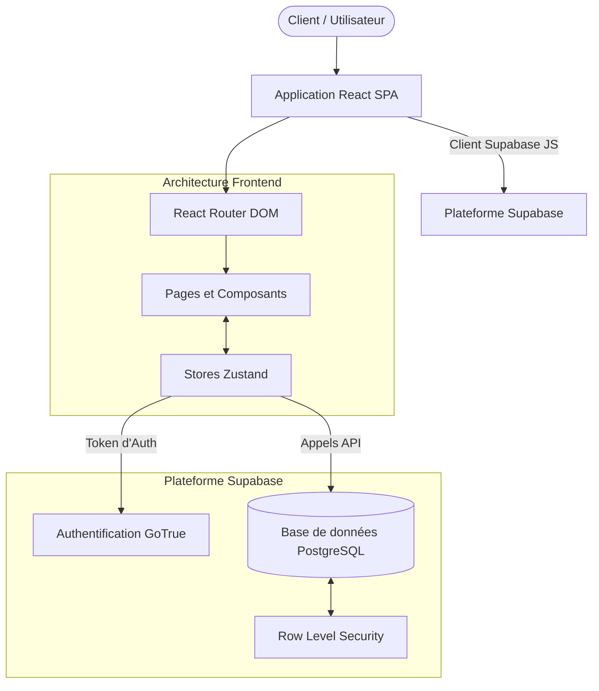

# Architecture du Système

## Vue d'ensemble
L'architecture est basée sur une approche moderne **BaaS (Backend-as-a-Service)** utilisant **Supabase** pour gérer la base de données et l'authentification, combinée à une **Single Page Application (SPA)** écrite en React (via Vite).

## Diagramme du Système

## Architecture Frontend
- **Framework** : React 19 combiné à Vite 6 pour un rechargement à chaud (HMR) rapide et une configuration de build optimisée.
- **Routage** : Géré nativement par `react-router-dom` v7. Fonctionne entièrement côté client avec des contextes de routage distincts :
  - Routes publiques (`/`, `/boutique`, `/produits`, etc.)
  - Routes protégées nécessitant une authentification via `<ProtectedRoute>` (`/commande`, `/compte`, etc.)
  - Routes administratives nécessitant un statut administrateur via `<AdminRoute>` (`/admin`).
- **Gestion de l'État Global** : **Zustand** est choisi à la place des Contextes React pour un paradigme de store léger et performant :
  - `authStore.ts` : Gère la session et la synchronisation du profil utilisateur.
  - `cartStore.ts` : Logique pour les opérations du panier, persistance locale (localStorage) et calculs des totaux.
  - `settingsStore.ts` : Paramètres globaux de l'application gérés depuis la BDD (ex: adresses, frais de livraison, bannières).
- **Style et UI** : Tailwind CSS v4 fournit un système de design utilitaire évolutif. Les transitions complexes, et les animations de mise en page utilisent `framer-motion`. Les icônes s'appuient principalement sur `lucide-react`.

## Architecture Backend (BaaS)
En adoptant Supabase, nous nous passons d'endpoints API Node.js classiques, optant plutôt pour une interaction directe avec PostgreSQL de manière sécurisée.
- **Client Supabase-JS** : Le SDK `@supabase/supabase-js` gère toute la récupération de données (CRUD) et l'authentification de manière transparente via l'interface PostgREST.
- **Sécurité des Données** : Au lieu de routes API middleware, la couche de données utilise le **Row Level Security (RLS)** de PostgreSQL.
  - *Exemple* : Les utilisateurs authentifiés ne peuvent faire un `SELECT` que sur les commandes où `user_id = auth.uid()`. Les administrateurs ont un accès plus large, régi par un flag booléen `is_admin` dans leurs `profiles`.
- **Flux de Triggers BDD** : Nous employons des triggers SQL pour l'automatisation, comme le trigger `on_auth_user_created` qui réplique automatiquement les nouveaux utilisateurs générés dans `auth.users` de Supabase vers notre table publique `profiles` pour joindre des métadonnées spécifiques à l'application (ex: points de fidélité, nom complet).

## Structure des Composants et Séparation de la Logique
- **Conteneurs vs Présentation** : Les pages principales dans `/src/pages/` orchestrent la logique et se connectent à Zustand/Supabase. Les petits composants dans `/src/components/` se concentrent sur la logique de rendu et le style (ex: `Button`, `Modal`, `CartSidebar`).
- **Services (`/src/lib/`)** : Les routines réutilisables de récupération de données et les définitions de types utilitaires (`types.ts`) sont structurées proprement à l'écart de la présentation. Toutes les interfaces TypeScript correspondent directement à nos tables de base de données associées.
