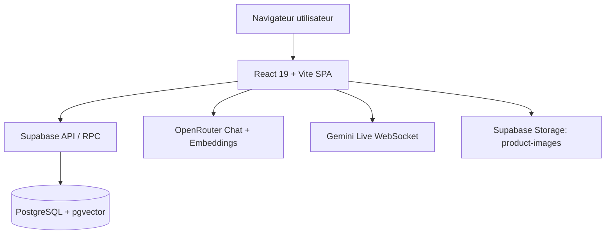

# ARCHITECTURE

## System Overview

Green Mood V2 est une application **SPA React + Vite** qui s’appuie sur **Supabase** comme backend managé (authentification, base PostgreSQL, stockage d’images, RPC SQL). Le front interagit directement avec Supabase via `@supabase/supabase-js` (pas de couche API Express active dans `src/`). Les pages publiques (catalogue, contenu SEO) et privées (compte, commandes, abonnements) cohabitent dans un routage React Router avec gardes d’accès (`ProtectedRoute`, `AdminRoute`).

Le domaine e-commerce est centralisé dans PostgreSQL (produits, commandes, stock, fidélité, promo, bundles, recommandations, POS). La logique métier critique est partagée entre le front (workflows UI, calculs panier, UX checkout, console admin) et des fonctions SQL côté Supabase (ex: `sync_bundle_stock`, `increment_promo_uses`, `get_product_recommendations`, `match_products`, `create_pos_customer`).

L’IA est intégrée en deux canaux: (1) **chat BudTender** avec OpenRouter (LLM + embeddings) et recherche vectorielle Supabase, (2) **voix temps réel** avec Gemini Live (`wss://generativelanguage.googleapis.com/ws/...`) pour le conseiller vocal. Les préférences et interactions IA sont persistées en base (`user_ai_preferences`, `budtender_interactions`) et exploitées dans l’expérience personnalisée.

## Frontend Architecture

### Routing
- Entrée: `src/App.tsx` avec lazy loading des pages.
- Routes publiques: accueil, boutique, catalogue, guides, pages légales.
- Routes protégées: checkout, espace compte, commandes, adresses, abonnements, fidélité, avis, favoris, parrainage.
- Routes admin: `/admin` et `/pos` hors layout standard (header/footer public).

### State Management (Zustand)
- `authStore`: session Supabase Auth, profil utilisateur, login/signup/reset password.
- `cartStore`: panier persistant (`persist`), type de livraison, totaux dépendants des settings.
- `settingsStore`: paramètres dynamiques de boutique depuis `store_settings`.
- Stores complémentaires: wishlist, notifications toast, préférences UI.

### Domain UI
- Parcours catalogue/produit: `Catalog`, `ProductDetail`, `RelatedProducts`, `FrequentlyBoughtTogether`.
- Parcours transactionnel: `Cart`, `Checkout`, `OrderConfirmation`.
- Espace client: adresses, profil, commandes, abonnements, reviews, referrals, fidélité.
- Back-office: tabs admin (analytics, POS, BudTender, subscriptions, promo codes, recommandations, reviews).

## Backend / API Architecture

## Execution model
- **Pas de backend Node/Express actif** malgré dépendance `express` présente dans `package.json`.
- Le frontend appelle directement Supabase (tables + RPC + storage + auth).

## Data access patterns
- CRUD direct sur les tables via `supabase.from(...)`.
- RPC SQL utilisées pour logique métier spécifique:
  - `get_product_recommendations`
  - `sync_bundle_stock`
  - `increment_promo_uses`
  - `match_products`
  - `create_pos_customer`

## Authentication & Authorization
- Authentification: Supabase Auth (`signInWithPassword`, `signUp`, reset/update password).
- Autorisation: RLS généralisée sur tables métier (owner policies, admin policies, lecture publique catalogue).
- Contrôle d’accès UI: composants `ProtectedRoute` et `AdminRoute`.

## Database Architecture

- Migrations SQL versionnées dans `supabase/`.
- Noyau e-commerce: `categories`, `products`, `orders`, `order_items`, `addresses`, `profiles`.
- Extensions métier:
  - Fidélité: `loyalty_transactions`
  - Abonnements: `subscriptions`, `subscription_orders`
  - Avis: `reviews`
  - Promotions: `promo_codes`
  - Bundles/recommandations: `bundle_items`, `product_recommendations`
  - IA: `user_ai_preferences`, `budtender_interactions`
  - Social commerce: `wishlists`, `referrals`
  - POS: `pos_reports`
- Recherche vectorielle: `products.embedding` + fonction `match_products` (pgvector).

## AI & Integrations

- **OpenRouter**
  - Chat completions depuis le widget BudTender.
  - Embeddings (`/api/v1/embeddings`) via front et scripts de sync.
- **Gemini**
  - Voix temps réel via WebSocket Live API.
  - Scripts utilitaires de test/sync autour de `@google/genai`.
- **Supabase Storage**
  - Upload/suppression d’images produit via bucket `product-images`.
- **Viva Wallet**
  - Variables présentes et hooks côté checkout/POS.
  - ⚠️ À compléter : implémentation serveur de paiement non exposée dans ce repository (appel backend commenté).

## Configuration & Deployment

- Build tooling: Vite 6 + React 19 + Tailwind 4.
- TypeScript en mode `noEmit`.
- Variables d’environnement documentées dans `.env.example`.
- Script de génération sitemap (`scripts/generate-sitemap.ts`).
- ⚠️ À compléter : pipeline CI/CD (aucun workflow visible dans le repository).
