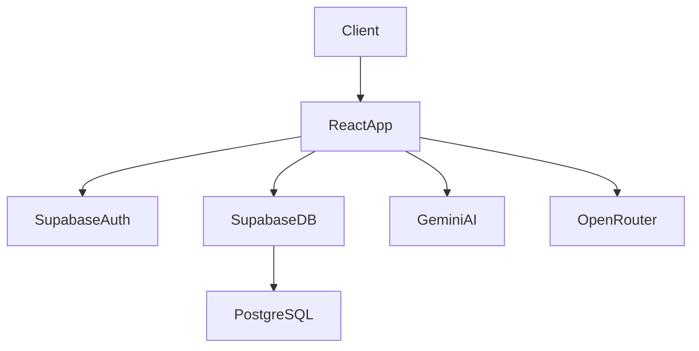

# Green Mood CBD (V2)

Plateforme e-commerce CBD complète avec assistant IA BudTender.

Green Mood CBD est une application e-commerce moderne conçue pour les boutiques CBD souhaitant centraliser **vente en ligne, gestion client et outils internes** dans une seule plateforme.
Elle combine une **expérience d’achat premium**, un **back-office complet** et un **assistant IA conversationnel (BudTender)** connecté au catalogue réel.

---

# Table of Contents

* Overview
* Tech Stack
* Key Features
* Architecture
* Prerequisites
* Installation
* Configuration
* Running the Project
* Scripts
* Project Structure
* API / Backend
* Database
* Authentication
* Third-Party Services
* Deployment
* Contributing
* License

---

# Overview

Green Mood CBD fournit une infrastructure complète pour les boutiques CBD :

* e-commerce moderne
* gestion client
* analytics
* POS magasin
* assistant IA vendeur

L’objectif est de proposer une **plateforme omnicanale** reliant boutique physique, e-commerce et recommandation intelligente.

---

# Badges


---

# Tech Stack

| Technology           | Role                        | Version   |
| -------------------- | --------------------------- | --------- |
| React                | Frontend framework          | ^19.0.0   |
| TypeScript           | Static typing               | ~5.8.2    |
| Vite                 | Build tool & dev server     | ^6.2.0    |
| @vitejs/plugin-react | React integration for Vite  | ^5.0.4    |
| Tailwind CSS         | UI styling                  | ^4.1.14   |
| React Router DOM     | SPA routing                 | ^7.13.1   |
| Zustand              | Global state management     | ^5.0.11   |
| Supabase JS          | Backend client (Auth + DB)  | ^2.98.0   |
| Gemini AI            | Conversational AI assistant | ^1.29.0   |
| OpenRouter           | Embeddings & AI routing     | —         |
| Recharts             | Analytics visualisation     | ^3.7.0    |
| Lucide React         | Icons                       | ^0.546.0  |
| PapaParse            | CSV import & parsing        | ^5.5.3    |
| motion               | UI animations               | ^12.23.24 |
| tsx                  | Execute TypeScript scripts  | ^4.21.0   |

---

# Key Features

## E-commerce Core

* Catalogue produits CBD avec pages détaillées
* Navigation catalogue (`/catalogue`)
* Pages produit SEO (`/catalogue/:slug`)
* Panier
* Checkout
* Confirmation de commande

## Customer Account

Espace client complet :

* profil utilisateur
* adresses
* historique de commandes
* abonnements
* favoris
* avis produits
* programme de fidélité
* système de parrainage

## AI BudTender Assistant

Assistant conversationnel spécialisé CBD :

* interaction texte
* interaction vocale temps réel
* accès direct au catalogue produit
* recommandations personnalisées
* mémoire utilisateur

## Admin Backoffice

Interface d’administration multi-modules :

* gestion produits
* catégories
* commandes
* stock
* clients
* analytics
* promotions
* recommandations IA
* abonnements
* avis
* parrainages
* configuration BudTender

## POS (Point of Sale)

Route dédiée :

```
/pos
```

Permet l’utilisation en boutique physique pour :

* vente directe
* gestion caisse
* synchronisation commandes

---

# Architecture



Architecture globale :

* **Frontend** : React SPA
* **Backend** : Supabase (serverless)
* **Database** : PostgreSQL
* **IA** : Gemini + OpenRouter
* **State management** : Zustand

---

# Prerequisites

Minimum requirements :

* Node.js >= 18 (Node 20 LTS recommandé)
* npm
* projet Supabase configuré

Clés API nécessaires :

* Gemini API
* OpenRouter API

Optionnel :

* credentials Viva Wallet

---

# Installation

### 1. Cloner le repository

```bash
git clone <repository-url>
cd Green-Mood-project
```

### 2. Installer les dépendances

```bash
npm install
```

### 3. Créer le fichier d'environnement

```bash
cp .env.example .env
```

### 4. Configurer les variables d'environnement

Voir la section **Configuration**.

### 5. Lancer le serveur de développement

```bash
npm run dev
```

---

# Configuration

Variables d’environnement principales :

| Variable                         | Description                                        | Required |
| -------------------------------- | -------------------------------------------------- | -------- |
| VITE_SUPABASE_URL                | URL du projet Supabase                             | Yes      |
| VITE_SUPABASE_ANON_KEY           | Clé publique Supabase                              | Yes      |
| VITE_GEMINI_API_KEY              | Clé API Gemini utilisée pour l’assistant BudTender | Yes      |
| VITE_OPENROUTER_API_KEY          | Clé API OpenRouter pour embeddings et LLM          | Yes      |
| VITE_OPENROUTER_EMBED_MODEL      | Modèle d'embedding OpenRouter                      | No       |
| VITE_OPENROUTER_EMBED_DIMENSIONS | Dimensions embeddings                              | No       |
| VITE_VIVA_CLIENT_ID              | Identifiant Viva Wallet                            | Optional |
| VITE_VIVA_CLIENT_SECRET          | Secret Viva Wallet                                 | Optional |
| VITE_VIVA_WALLET_BASE_URL        | URL API Viva Wallet                                | Optional |
| DISABLE_HMR                      | Désactive le HMR Vite si `true`                    | No       |

⚠️ Certaines variables présentes dans `.env.example` ne sont pas entièrement documentées dans le code frontend.

---

# Running the Project

### Development

```bash
npm run dev
```

Serveur Vite disponible sur :

```
http://localhost:3000
```

### Production build

```bash
npm run build
```

Build généré dans :

```
/dist
```

### Preview du build

```bash
npm run preview
```

---

# Scripts

| Script  | Description              |
| ------- | ------------------------ |
| dev     | Lance le serveur Vite    |
| build   | Build production         |
| preview | Prévisualise le build    |
| lint    | Type check TypeScript    |
| clean   | Supprime le dossier dist |

---

# Project Structure

```
.
├── public/                  # Assets statiques, sitemap, PWA
├── scripts/                 # Scripts utilitaires (embeddings, sitemap)
├── src/
│   ├── components/          # UI partagée + modules admin + BudTender
│   ├── hooks/               # Hooks React custom
│   ├── lib/                 # Clients, utilitaires, embeddings, types
│   ├── pages/               # Pages applicatives (shop, admin, account)
│   ├── store/               # Stores Zustand
│   ├── seo/                 # Provider SEO
│   ├── App.tsx              # Définition des routes
│   └── main.tsx             # Bootstrap React
└── supabase/                # Migrations SQL et scripts base de données
```

---

# API / Backend

L’application communique directement avec **Supabase** via le client officiel :

```
@supabase/supabase-js
```

La logique métier backend est partiellement implémentée via :

* fonctions SQL
* RPC Supabase
* recherche vectorielle
* triggers base de données

⚠️ Aucun backend Node.js ou Express dédié n’est présent dans ce dépôt.

---

# Database

Technologie :

**PostgreSQL via Supabase**

Entités principales :

* products
* categories
* profiles
* orders
* order_items
* addresses
* store_settings
* loyalty_transactions
* subscriptions
* subscription_orders
* reviews
* promo_codes
* bundle_items
* product_recommendations
* referrals
* wishlists
* product_images
* user_ai_preferences
* budtender_interactions
* pos_reports

Les migrations sont versionnées dans :

```
/supabase
```

---

# Authentication

Authentification gérée par **Supabase Auth** :

* inscription
* connexion
* reset password
* gestion de session

Protection des routes via :

* `ProtectedRoute`
* `AdminRoute`

---

# Third-Party Services

| Service       | Purpose                            |
| ------------- | ---------------------------------- |
| Supabase      | Authentification + base de données |
| Google Gemini | Assistant IA BudTender             |
| OpenRouter    | Embeddings et routing LLM          |
| Viva Wallet   | Paiements                          |

---

# Deployment

⚠️ Aucun pipeline CI/CD détecté dans ce repository.

Déploiement possible sur :

* Vercel
* Netlify
* Docker
* VPS / cloud

---

# Contributing

Conventions de branches :

```
feat/*
fix/*
docs/*
```

Chaque Pull Request doit inclure :

* description claire
* validation `npm run lint`
* captures si modification UI

---

# License

MIT License
