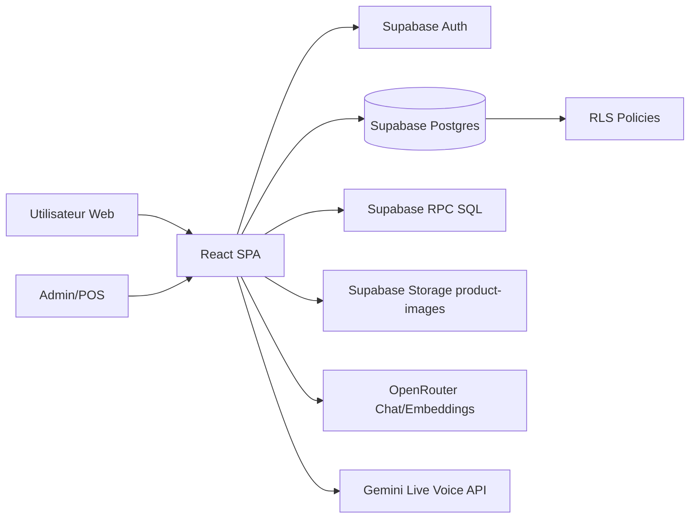

# Documentation produit complète — Green Mood CBD

> **Périmètre d’audit** : revue du code source frontend React/TypeScript, des stores Zustand, des composants métier (catalogue, checkout, compte, admin, POS, BudTender IA), des scripts utilitaires et des migrations SQL Supabase présentes dans le dépôt.

---

## 1. Vue d’ensemble de l’application

### Nom de l’application
- **Green Mood CBD** (nom métier produit).
- Le `package.json` conserve encore un nom technique générique (`react-example`) qui ne reflète pas le branding final.

### Objectif principal
Offrir une plateforme **e-commerce CBD omnicanale** combinant :
- boutique en ligne,
- espace client complet,
- back-office admin,
- module POS (vente en boutique),
- assistant IA (BudTender) textuel et vocal.

### Problème résolu
La solution centralise des besoins généralement dispersés entre plusieurs outils :
- vente e-commerce,
- gestion catalogue et stock,
- fidélisation (points, abonnements, parrainage),
- support conseil produit (IA),
- opérations magasin (POS),
- pilotage business (analytics/reporting).

### Utilisateurs ciblés
- **Visiteurs non connectés** : navigation contenu + catalogue.
- **Clients connectés** : achat, suivi commandes, compte, abonnements, avis, favoris, parrainage.
- **Admins** : gestion complète opérationnelle et commerciale.
- **Équipe boutique** (via admin/POS) : ventes en caisse, clients, fermeture de caisse.

### Architecture générale
- **Frontend** : SPA React + React Router.
- **Backend** : Supabase (Auth + PostgREST + RPC SQL + Storage).
- **Base de données** : PostgreSQL (RLS + extensions vectorielles).
- **IA** : OpenRouter (chat + embeddings) + Gemini Live (voix temps réel).

### Stack technique
- React 19, TypeScript, Vite.
- Zustand (state global), Tailwind (style), Motion (animations), Recharts (analytics), PapaParse (CSV).
- Supabase JS.
- APIs externes : OpenRouter, Gemini; Viva Wallet partiellement préparé.

---

## 2. Architecture technique

### Structure des dossiers (logique)
- `src/pages/` : écrans routés.
- `src/components/` : composants UI + widgets métier + modules admin.
- `src/store/` : stores Zustand (auth, panier, settings, wishlist, toasts).
- `src/hooks/` : logique IA mémoire et voix.
- `src/lib/` : types, clients, utilitaires, SEO, prompts/settings IA.
- `supabase/` : migrations SQL et patchs.
- `scripts/` + scripts TS racine : maintenance embeddings / checks.
- `public/` : assets statiques, sitemaps, PWA/service worker.

### Organisation du code
- Application principalement **frontend-driven** : la logique métier client appelle directement Supabase.
- Routage lazy-loaded dans `App.tsx`.
- Séparation claire entre : pages publiques, pages protégées, et routes admin.

### Frameworks & librairies clés
- React Router pour pages et protection par wrappers (`ProtectedRoute`, `AdminRoute`).
- Zustand pour l’état cross-page (auth/session, panier persistant, settings dynamiques).
- Supabase JS pour auth/session, CRUD, RPC, storage.

### Authentification
- Supabase Auth (email/password, reset password).
- Initialisation session via `getSession` + abonnement `onAuthStateChange`.
- Enrichissement de profil via table `profiles`.
- Suivi device/session active via `user_active_sessions`.

### Gestion d’état
- **authStore** : user, profile, session, auth actions.
- **cartStore (persist)** : items, livraison, totalisation.
- **settingsStore** : `store_settings` + fallback defaults.
- **wishlistStore** et **toastStore** pour UX.

### Communication API
- Principalement Supabase `.from(...)`, `.rpc(...)`, `.auth...`, `.storage...`.
- Requêtes externes `fetch` pour OpenRouter et embeddings.
- Endpoint paiement `/api/payment/create-order` mentionné mais non réellement implémenté dans ce repo.

### Base de données & modèles
- Modèle orienté commerce : catalogue, commandes, stock, clients.
- Extensions métier : fidélité, abonnements, avis, promo, parrainage.
- Extensions IA : préférences IA utilisateur, interactions BudTender, embeddings produits.

### Services externes
- OpenRouter (chat + embeddings).
- Gemini Live WebSocket (assistant vocal).
- Viva Wallet : variables prévues, implémentation backend absente.

### Diagramme logique

---

## 3. Liste complète des fonctionnalités

## Authentification
1. **Connexion / inscription email-password**  
   - Objectif : accéder à l’espace compte et checkout sécurisé.  
   - Écrans : `/connexion`, `/mot-de-passe-oublie`, `/reinitialiser-mot-de-passe`.  
   - API : `supabase.auth.signInWithPassword`, `signUp`, `resetPasswordForEmail`, `updateUser`.  
   - Conditions : publique.
2. **Création profil automatique et enrichissement**  
   - Trigger SQL `handle_new_user`, récupération profil dans `authStore`.  
   - Conditions : utilisateur authentifié.
3. **Gestion sessions actives device**  
   - Upsert `user_active_sessions` depuis `authStore`.

## Gestion du compte
1. **Tableau de bord compte** (`/compte`) : accès rapide commandes, adresses, profil, fidélité, etc.
2. **Profil utilisateur** (`/compte/profil`) : mise à jour nom/téléphone.
3. **Adresses** (`/compte/adresses`) : CRUD adresses + adresse par défaut.
4. **Commandes** (`/compte/commandes`) : historique, détail, action recommander.
5. **Favoris** (`/compte/favoris`) : wishlist produits.
6. **Avis** (`/compte/avis`) : gestion avis post-achat.
7. **Fidélité** (`/compte/fidelite`) : historique transactions de points.
8. **Parrainage** (`/compte/parrainage`) : visualisation statut filleuls + récompenses.
9. **Abonnements** (`/compte/abonnements`) : pause/reprise/annulation/changement fréquence.

## Fonctionnalités e-commerce principales
1. **Catalogue filtrable/recherchable** (`/catalogue`) : filtres catégorie/prix/attributs/sort.
2. **Fiche produit** (`/catalogue/:slug`) : détails, notes, recommandations associées.
3. **Panier persistant** (`/panier`) : quantités, livraison, total.
4. **Checkout** (`/commande`) : création `orders` + `order_items`, adresse, promo, points fidélité.
5. **Confirmation** (`/commande/confirmation`).
6. **Codes promo** : validation/usage via table `promo_codes` + RPC `increment_promo_uses`.
7. **Bundles** : synchronisation de stock via RPC `sync_bundle_stock`.
8. **Cross-sell** : produits liés (`get_product_recommendations` + composants dédiés).

## Dashboard / Admin
1. **Dashboard KPI** : CA total/mois, commandes, stock faible/rupture, clients, commandes récentes.
2. **Produits** : CRUD, images, attributs, activation/disponibilité, bundle flags.
3. **Catégories** : CRUD + ordre d’affichage.
4. **Commandes** : suivi statuts.
5. **Stock** : ajustements + mouvements.
6. **Clients** : listing et bascule rôle admin.
7. **Paramètres store** : bannière, livraison, réseaux, toggles features.
8. **Analytics** : graphes et distribution business.
9. **Parrainage** : réglages récompenses et suivi.
10. **Abonnements** : gestion opérationnelle des plans et commandes associées.
11. **Avis** : modération publication/suppression.
12. **Codes promo** : CRUD/activation.
13. **Recommandations produits** : gestion explicite des liens de cross-sell.
14. **BudTender settings** : prompt, provider/model, température, tokens, activation.
15. **POS settings/reporting** : configuration et reporting caisse.

## Notifications
- Toasters UI pour succès/erreurs sur actions clés.
- Pas de système d’email transactionnel custom dans le repo (hors emails natifs Supabase Auth).

## Paiement
- Structure de paiement présente (Viva order code, endpoint prévu) mais backend de paiement **non finalisé** dans ce dépôt.

## Intégrations externes
- OpenRouter chat completions (assistant texte).
- OpenRouter embeddings (recherche sémantique).
- Gemini Live pour conversation vocale temps réel.
- Supabase Storage bucket `product-images`.

## Autres fonctionnalités
- **SEO** : composant SEO + JSON-LD + pages guides.
- **Age Gate** : contrôle visuel d’accès (client-side).
- **PWA/service worker** + manifest.
- **Import CSV** admin pour catégories/produits.

---

## 4. Parcours utilisateur (User Journey)

### A. Utilisateur non connecté
1. Arrive sur `/` (home branding + CTA).
2. Explore `/catalogue`, `/boutique`, `/guides`, pages éditoriales.
3. Ajoute des produits au panier (`/panier`).
4. Tente checkout (`/commande`) -> redirection vers login si non authentifié.
5. Sur `/connexion` :
   - soit connexion,
   - soit inscription (avec validations mot de passe).
6. Après auth : accès compte et checkout.

### B. Utilisateur connecté
1. Navigation principale avec header + recherche prédictive.
2. Peut dialoguer avec BudTender widget (si activé en settings).
3. Peut acheter (panier → checkout → confirmation).
4. Peut revenir dans `/compte` pour suivre commandes, gérer adresses/profil, fidélité, avis, favoris, abonnements, parrainage.

### C. Parcours admin
1. Connexion avec profil `is_admin=true`.
2. Accès `/admin` (ou `/pos`) via `AdminRoute`.
3. Bascule entre onglets de pilotage (produits, commandes, etc.).
4. Exécute actions CRUD et opérations de stock/marketing.

### D. Parcours POS (opérateur boutique)
1. Accès `/pos` (admin).
2. Recherche/scan produit, constitution panier caisse.
3. Application promo, utilisation points.
4. Encaissement/validation commande en base.
5. Clôture de session caisse (pos reports).

---

## 5. Cartographie des écrans/routes

## Routes publiques
- `/` : Home, vitrine premium + CTA catalogue.
- `/boutique` : présentation magasin/expérience.
- `/produits` : présentation gamme.
- `/catalogue` : listing e-commerce filtrable.
- `/catalogue/:slug` : détail produit + reviews + recommandations + abonnement.
- `/qualite` : qualité/légalité CBD.
- `/contact` : informations contact.
- `/mentions-legales` : cadre juridique.
- `/guides` : hub éditorial.
- `/guides/*` (5 slugs) : contenu SEO expert.
- `/panier` : panier.
- `/connexion`, `/mot-de-passe-oublie`, `/reinitialiser-mot-de-passe` : auth.

## Routes protégées (user)
- `/commande` : checkout.
- `/commande/confirmation` : confirmation.
- `/compte` : hub compte.
- `/compte/commandes`, `/compte/adresses`, `/compte/abonnements`, `/compte/fidelite`, `/compte/avis`, `/compte/favoris`, `/compte/parrainage`, `/compte/profil`.

## Routes admin
- `/admin` : shell back-office multi-onglets.
- `/pos` : caisse et opérations magasin.

## Fallback
- `*` : 404.

---

## 6. Flux de données

### Flux frontend ↔ backend
1. Composant/page déclenche action (ex: ajout panier, submit checkout).
2. Store local (Zustand) est mis à jour pour feedback immédiat.
3. Appels Supabase:
   - lecture/écriture tables,
   - RPC pour logique SQL,
   - Auth pour session.
4. Retour API -> UI rerender + toast.

### State management
- **Client state transitoire** : `useState` local pages.
- **Global state** : Zustand stores.
- **Persisté navigateur** : panier (`persist middleware`) + device id session tracking.

### Validation
- Validations frontend (forms login, checkout, adresses, etc.).
- Validation base via contraintes SQL + RLS + checks (promo, referrals, etc.).

### Stockage
- Données métier : Postgres Supabase.
- Médias produit : Supabase Storage.
- Assets statiques : `public/`.

---

## 7. Modèle de données

## Entités principales
- **Catalogue** : `categories`, `products`, `product_images`, `bundle_items`, `product_recommendations`.
- **Comptes** : `profiles`, `addresses`, `wishlists`, `user_active_sessions`.
- **Commandes** : `orders`, `order_items`, `stock_movements`, `promo_codes`.
- **Engagement** : `loyalty_transactions`, `subscriptions`, `subscription_orders`, `reviews`, `referrals`.
- **IA** : `user_ai_preferences`, `budtender_interactions`.
- **POS** : `pos_reports`.
- **Configuration** : `store_settings`.

## Relations (principales)
- `products.category_id -> categories.id`.
- `orders.user_id -> profiles.id`.
- `order_items.order_id -> orders.id`, `order_items.product_id -> products.id`.
- `subscriptions.user_id -> profiles.id`, `subscriptions.product_id -> products.id`.
- `reviews.user_id/product_id/order_id` vers entités correspondantes.
- `referrals.referrer_id/referee_id -> profiles.id`.

## Contraintes & sécurité
- RLS activée sur tables métier.
- Politiques séparant accès public (catalogue), propriétaire (données user), admin (gestion globale).

---

## 8. Systèmes importants

### Authentification
- Supabase Auth + profile projection en store.
- Password reset flow complet.

### Permissions
- Frontend : guards (`ProtectedRoute`, `AdminRoute`).
- Backend : RLS + `is_admin` dans `profiles`.

### Paiements
- Colonnes order prévues (`viva_order_code`, payment_status).
- Endpoint Viva attendu mais non câblé côté backend dans ce dépôt.

### Emails
- Confirmations/auth password reset déléguées à Supabase Auth.

### Notifications
- Toast system interne (UI).

### Upload fichiers
- Upload images produits via composant admin + policies storage.

### Intégrations externes
- OpenRouter chat+embeddings.
- Gemini Live voix.

### Jobs / automatisation
- Scripts TS pour synchronisation embeddings et génération sitemap.
- Triggers SQL (profil à la création user, sync stock bundles, referral code).

---

## 9. Logique métier principale

1. **Règles panier/livraison**
   - Livraison gratuite selon seuil `store_settings.delivery_free_threshold`.
2. **Checkout**
   - Calcul total + promo + points + écriture `orders`/`order_items`.
3. **Stock**
   - Mouvements de stock historisés.
   - Bundles recalculés automatiquement (RPC/trigger).
4. **Fidélité**
   - Points gagnés/consommés via `loyalty_transactions`.
5. **Parrainage**
   - Code parrain généré SQL.
   - Liaison referrer/referee à l’inscription + welcome bonus paramétrable.
6. **Abonnements**
   - Statuts `active/paused/cancelled`, fréquence configurable.
7. **Recommandation produit**
   - Priorité recommandations explicites, fallback même catégorie.
8. **BudTender IA**
   - Prompt configuré en settings.
   - Contexte catalogue + mémoire préférences + historique interactions.
   - Recherche sémantique via embeddings et RPC vectoriel.

---

## 10. Fonctionnalités implicites / partielles / code mort

1. **Paiement Viva partiel** : préparation présente, implémentation serveur absente.
2. **Double piste embeddings (768/3072)** : migrations coexistantes, état cible à clarifier.
3. **Duplication historique migrations IA** : `migration_v2` et `migration_v4` touchent des tables proches.
4. **Nom package non aligné produit** : signal de dette de packaging/release.
5. **Présence de scripts debug/check** : utiles en maintenance mais pas intégrés à CI visible.

---

## 11. Limites et améliorations

### Technique
- Ajouter un backend API explicite pour paiements (webhooks, sécurisation server-side).
- Normaliser stratégie embeddings (dimension unique, migration propre, index final).
- Introduire tests automatisés (unitaires + e2e checkout/admin).
- Ajouter linting/formatting strict (ESLint/Prettier) si absent.

### Produit
- Documenter officiellement règles promo/fidélité (cas limites).
- Clarifier UX erreurs réseau (fallbacks plus homogènes).
- Ajouter observabilité (logs structurés, Sentry, dashboards uptime).

### Architecture
- Factoriser certaines requêtes Supabase répétées en services/hooks partagés.
- Ajouter couche BFF ou Edge Functions pour logique sensible (prix, paiements, anti-fraude).

---

## 12. Résumé global

Green Mood CBD est une application e-commerce **très complète** et déjà orientée exploitation réelle :
- front premium orienté conversion,
- compte client avancé,
- back-office étendu,
- POS intégré,
- moteur IA BudTender textuel + vocal.

Son architecture est moderne (React + Supabase + IA APIs), avec une logique métier déjà riche (stock, fidélité, abonnements, parrainage, recommandations). Les principaux chantiers restants concernent la **finalisation paiements server-side**, la **standardisation embeddings**, et le **renforcement de la qualité logicielle (tests/CI/observabilité)**.

---

## Hypothèses explicites

- L’audit se base sur les fichiers présents dans le dépôt local; aucune infra externe privée (projet Supabase live, secrets réels, backend séparé) n’a été inspectée.
- Certaines règles peuvent être complétées côté SQL/RLS en production si des migrations hors-repo existent.
- Les flux paiement sont décrits comme partiels car les endpoints backend correspondants ne sont pas implémentés ici.
